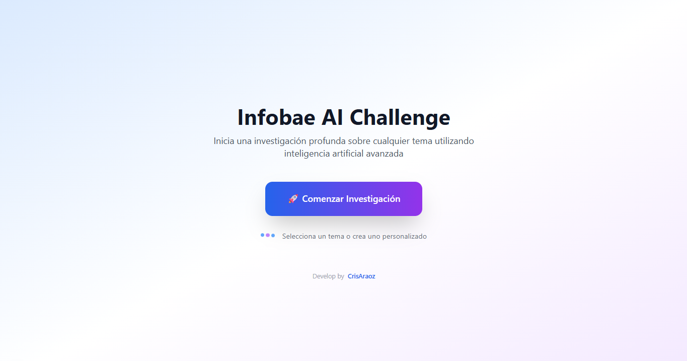
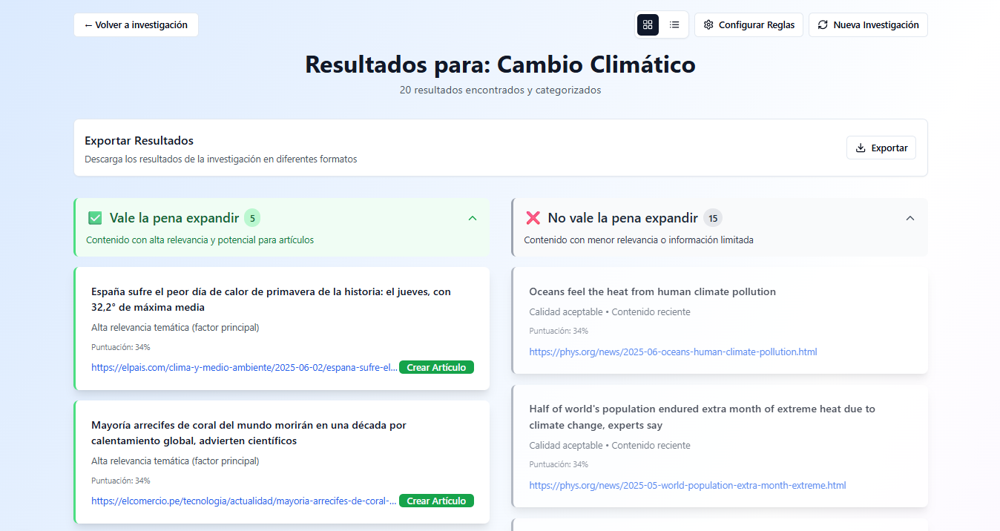
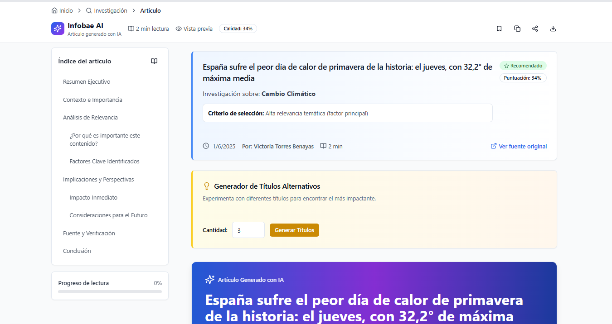

# 🔍 Infobae AI Challenge - Sistema de Investigación Inteligente

Un sistema avanzado de investigación que utiliza inteligencia artificial para buscar, analizar y categorizar contenido relevante sobre cualquier tema, generando artículos de alta calidad basados en fuentes confiables.

## 🚀 Inicio Rápido

### 📋 Prerrequisitos

- **Node.js 18+**
- **npm** o **yarn**
- **Claves de API** (ver configuración más abajo)

### ⚡ Instalación y Configuración

1. **Clonar el repositorio**
   ```bash
   git clone https://github.com/crisaraoz/infobae-challenge.git
   cd infobae-ai-challenge
   ```

2. **Instalar dependencias**
   ```bash
   npm install
   ```

3. **Configurar variables de entorno**
   
   Crea un archivo `.env.local` en la raíz del proyecto:
   
   ```env
   # 🔑 APIs Requeridas
   EXA_API_KEY=your_exa_api_key_here
   OPENAI_API_KEY=your_openai_api_key_here
   
   # 🚀 Optimizaciones de desarrollo (opcional)
   NEXT_PRIVATE_SKIP_VALIDATION=1
   NEXT_PRIVATE_STANDALONE=1
   NEXT_PRIVATE_BUILD_WORKER=1
   NODE_OPTIONS="--max-old-space-size=4096"
   FAST_REFRESH=true
   ```

4. **Obtener las claves de API**

   **🔍 Exa API Key:**
   - Visita: [https://exa.ai/](https://exa.ai/)
   - Regístrate y obtén tu API key
   - Servicio de búsqueda semántica avanzada

   **🤖 OpenAI API Key:**
   - Visita: [https://platform.openai.com/api-keys](https://platform.openai.com/api-keys)
   - Crea una cuenta y genera tu API key
   - Necesario para procesamiento de texto y resúmenes

5. **Ejecutar el proyecto**
   ```bash
   # Modo desarrollo normal
   npm run dev
   
   # Modo desarrollo ultra-rápido (sin type checking)
   npm run dev:fast
   ```

6. **¡Listo!** 🎉
   
   Abre [http://localhost:3000](http://localhost:3000) en tu navegador.


## 🏗️ Arquitectura del Sistema

### 📁 Estructura del Proyecto

```
src/
├── 🔌 integrations/      # APIs externas
│   ├── exa/             # Búsqueda con Exa API
│   └── openai/          # Procesamiento con OpenAI
├── 🧠 analysis/         # Lógica de análisis
│   ├── heuristics.ts    # Algoritmos de categorización
│   └── contentProcessor.ts # Procesamiento completo
├── ⚙️ services/         # Servicios principales
│   └── researchService.ts
├── 🎯 app/              # Aplicación Next.js
│   ├── actions/         # Server Actions
│   ├── research/        # Página de resultados
│   ├── investigation/   # Página de búsqueda
│   └── article/         # Generación de artículos
├── 🧩 components/       # Componentes UI
├── 🔧 hooks/           # Hooks personalizados
│   ├── useCategorizationRules.ts  # Gestión de reglas personalizadas
│   ├── useExcelExport.ts          # Exportación a Excel/CSV
│   └── useResearchCache.ts        # Cache de investigaciones
└── 
```

### 🔄 Flujo de Funcionamiento

1. **Usuario ingresa tema** → Página de investigación
2. **Optimización de consulta** → OpenAI mejora la búsqueda
3. **Búsqueda de contenido** → Exa API encuentra fuentes
4. **Análisis de resultados** → Heurísticas categorizan contenido
5. **Presentación** → Resultados organizados por relevancia
6. **Generación de artículos** → Creación de contenido expandido

## 🎮 Funcionalidades

### ✨ Características Principales

- **🔍 Búsqueda Inteligente**: Utiliza Exa API para búsquedas semánticas avanzadas
- **🚀 Análisis con IA**: OpenAI procesa y optimiza consultas
- **📊 Categorización Automática**: Algoritmos heurísticos evalúan relevancia
- **🎯 Generación Automátática de Artículos y Títulos**: En base a un tópico, url ó imágen provista
- **⚡ Cache Inteligente**: Sistema de caché para mejorar rendimiento
- **📱 Responsive Design**: Interfaz adaptada a todos los dispositivos
- **🎨 UI Moderna**: Componentes con Tailwind CSS y Radix UI

## 📸 Demo y Capturas del Sistema

### 🎬 Video Demo

<div align="center">
  
  <!-- Opción 1: GIF Demo Directo (sin necesidad de descargar) -->
  
  
  <p><em>👆 Demo interactivo mostrando todas las funcionalidades</em></p>
  
  <!-- Opción 2: Descarga directa desde GitHub Release -->
  <p>
    📥 <a href="https://github.com/crisaraoz/infobae-challenge/releases/download/v1.0.0/demoVideo.mkv" target="_blank">
      Descargar Video Demo Original (17MB)
    </a>
  </p>
  
  <!-- Enlaces adicionales -->
  <p>
    <a href="https://github.com/crisaraoz/infobae-challenge/releases/latest" target="_blank">📦 Ver Release Completo</a>
  </p>

</div>

### 🖼️ Galería de Funcionalidades

#### 🔍 1. Página de Investigación Principal
<div align="center">
  
  <p><em>Interfaz principal con búsqueda inteligente y opciones avanzadas</em></p>
</div>

#### ⚡ 2. Generación de Índices para Investigaciones
<div align="center">
  
  <p><em>En base a tópicos predefinidos, personalizados ó URLs/Imágenes</em></p>
</div>

#### 📊 3. Proceso de Búsqueda en Tiempo Real
<div align="center">
  
  <p><em>Sistema de progreso dinámico con indicadores visuales de estado</em></p>
</div>

#### 📱 4. Vista de Resultados de Investigaciones
<div align="center">
  
  <p><em>Diseño completamente responsive optimizado para dispositivos desktop/móviles</em></p>
</div>

#### 🎨 5. Generación de Artículos con IA
<div align="center">
  
  <p><em>Sistema avanzado de generación de artículos desde URLs e imágenes</em></p>
</div>

#### ✨ 6. Vista de Artículo Optimizada
<div align="center">
  
  <p><em>Interfaz moderna del artículo con tabla de contenidos, progress tracker y funciones de descarga</em></p>
</div>


## 🔮 Posibilidad de Mejoras Futuras

### 🎯 Versión 2.0

- **📊 Dashboard Analytics**
  - Métricas de uso y rendimiento
  - Estadísticas de investigaciones
  - Análisis de tendencias de búsqueda

- **🔄 Integraciones Adicionales**
  - Google Scholar API
  - PubMed para artículos científicos
  - News API para noticias recientes
  - Wikipedia API para contexto general

- **🧠 Mejoras de IA**
  - Soporte para múltiples modelos (Claude, Gemini)
  - Análisis de sentimiento
  - Detección de sesgos
  - Fact-checking automático

### 🎯 Versión 2.5

- **👥 Funcionalidades Colaborativas**
  - Equipos de investigación
  - Comentarios y anotaciones
  - Historial compartido
  - Workflows colaborativos

- **🔒 Seguridad y Privacidad**
  - Autenticación avanzada
  - Encriptación de datos sensibles
  - Auditoría de accesos
  - Cumplimiento GDPR

### 🎯 Versión 3.0

- **📱 Aplicación Móvil**
  - React Native
  - Sincronización offline
  - Notificaciones push

- **🤖 IA Avanzada**
  - Generación de imágenes
  - Análisis de video/audio
  - Procesamiento multimodal
  - Agentes autónomos

## 🛠️ Tecnologías Utilizadas

### 🎨 Frontend
- **Next.js 15** - Framework React con Turbopack
- **TypeScript** - Tipado estático
- **Tailwind CSS** - Styling utility-first
- **Radix UI** - Componentes accesibles
- **Lucide React** - Iconos modernos

### 🔧 Backend/APIs
- **OpenAI API** - Procesamiento de lenguaje natural
- **Exa API** - Búsqueda semántica avanzada
- **Next.js Server Actions** - Server-side logic

### 🔨 Herramientas de Desarrollo
- **ESLint** - Linting de código
- **Prettier** - Formateo de código
- **TypeScript** - Type checking
- **Turbopack** - Bundling ultra-rápido

### 🛠️ Scripts Disponibles

```bash
# Desarrollo
npm run dev          # Servidor de desarrollo con Turbopack
npm run dev:fast     # Desarrollo sin type checking (más rápido)

# Construcción
npm run build        # Build de producción
npm run build:analyze # Análisis del bundle

# Calidad de código
npm run lint         # Ejecutar ESLint
npm run lint:fix     # Corregir errores automáticamente
npm run type-check   # Verificar tipos TypeScript

# Utilidades
npm run optimize     # Aplicar optimizaciones de rendimiento
```

## 📝 Scripts de Configuración

### 🔧 Optimización Automática

```bash
# Aplicar todas las optimizaciones de rendimiento
npm run optimize
```

Este script automáticamente:
- Limpia caché de Next.js
- Crea archivo .env.local con optimizaciones
- Verifica configuraciones
- Aplica mejores prácticas

### 🧹 Limpieza de Proyecto

```bash
# Limpiar completamente el proyecto
Remove-Item -Recurse -Force .next, node_modules
npm install
npm run dev
```

## ⚠️ Notas Importantes

### 🔑 Seguridad de API Keys
- **NUNCA** subas tus claves al repositorio
- Usa `.env.local` que está en `.gitignore`
- Rota las claves periódicamente
- Limita el uso de APIs según necesidad

### 💾 Recomendaciones de Desarrollo
- **Filesystem**: Mover el proyecto fuera de OneDrive para mejor rendimiento
- **Memoria**: Usa al menos 8GB RAM para desarrollo fluido
- **Node.js**: Versión 18+ recomendada
- **Antivirus**: Excluye `node_modules` y `.next` del escaneo

