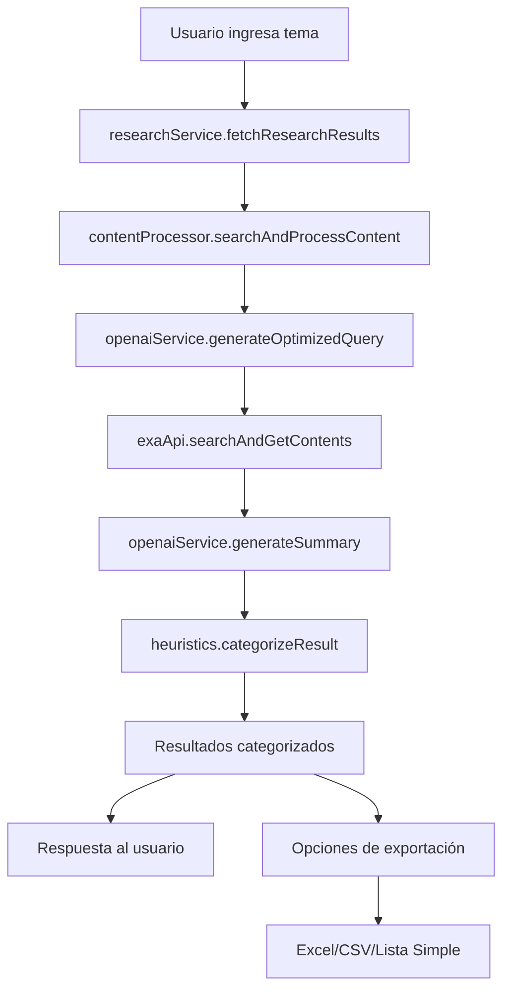

# 🏗️ Arquitectura del Sistema de Investigación

## 📁 Estructura de Carpetas

```
src/
├── 🔌 integrations/      # Integraciones con APIs externas
│   ├── exa/             # API de búsqueda Exa
│   │   └── exaApi.ts
│   └── openai/          # API de OpenAI para procesamiento
│       └── openaiService.ts
├── 🧠 analysis/         # Lógica de análisis y procesamiento
│   ├── heuristics.ts    # Algoritmos de categorización
│   └── contentProcessor.ts # Procesamiento completo de contenido
├── ⚙️ services/         # Servicios principales (orquestadores)
│   └── researchService.ts
├── 📚 lib/              # Utilidades y mocks
│   └── mocks.ts
├── 🪝 hooks/            # Custom React Hooks
│   ├── useCategorizationRules.ts  # Gestión de reglas personalizadas
│   ├── useExcelExport.ts          # Exportación a Excel/CSV
│   └── useResearchCache.ts        # Cache de investigaciones
└── 🎯 app/              # Aplicación Next.js
    ├── actions/         # Server Actions
    └── ...
```

## 🔄 Flujo de Datos



## 📦 Módulos y Responsabilidades

### 🔌 **Integrations** - Comunicación con APIs Externas

#### `integrations/exa/exaApi.ts`
- **Propósito**: Comunicación directa con la API de Exa
- **Funciones principales**:
  - `searchExaContent()` - Búsqueda en Exa
  - `getExaContents()` - Obtención de contenido completo
  - `searchAndGetContents()` - Búsqueda combinada

#### `integrations/openai/openaiService.ts`
- **Propósito**: Comunicación con OpenAI para optimización y resúmenes
- **Funciones principales**:
  - `generateOptimizedQuery()` - Optimización de consultas
  - `generateSummary()` - Generación de resúmenes

### 🧠 **Analysis** - Lógica de Análisis

#### `analysis/heuristics.ts`
- **Propósito**: Algoritmos de categorización y análisis de calidad
- **Funciones principales**:
  - `categorizeResult()` - Categorización principal (ahora con reglas personalizables)
  - `categorizeByFreshness()` - Análisis de frescura
  - `categorizeByContentQuality()` - Análisis de calidad
  - `categorizeBySourceAuthority()` - Análisis de autoridad
  - `categorizeByKeywordRelevance()` - Análisis de relevancia

#### `analysis/contentProcessor.ts`
- **Propósito**: Orquestación del procesamiento completo
- **Funciones principales**:
  - `searchAndProcessContent()` - Proceso completo de búsqueda
  - `processSearchResults()` - Procesamiento de resultados

### ⚙️ **Services** - Orquestadores Principales

#### `services/researchService.ts`
- **Propósito**: Punto de entrada principal para investigación
- **Funciones principales**:
  - `fetchResearchResults()` - Función principal pública

### 🪝 **Hooks** - Lógica de Estado y Efectos

#### `hooks/useCategorizationRules.ts`
- **Propósito**: Gestión de reglas de categorización personalizables
- **Funciones principales**:
  - `createRule()` - Crear nuevas reglas
  - `updateRule()` - Actualizar reglas existentes
  - `activateRule()` - Activar reglas específicas
  - `applyPreset()` - Aplicar presets predefinidos

#### `hooks/useExcelExport.ts` ⭐ **NUEVO**
- **Propósito**: Exportación de resultados en múltiples formatos
- **Funciones principales**:
  - `exportToExcel()` - Exportación completa con múltiples hojas
  - `exportSimpleList()` - Lista simple con título y URL
  - `exportAsCSV()` - Formato CSV para análisis
- **Características**:
  - **Hojas separadas**: Resumen, Vale la pena expandir, No vale la pena expandir
  - **Metadatos incluidos**: Fecha, hora, estadísticas de categorización
  - **Formatos múltiples**: XLSX, CSV
  - **Nombres de archivo inteligentes**: Con tema y timestamp

#### `hooks/useResearchCache.ts`
- **Propósito**: Cache local de investigaciones para mejor UX
- **Funciones principales**:
  - `getCache()` - Obtener datos cacheados
  - `setCache()` - Guardar en cache
  - `clearCache()` - Limpiar cache

## 🎯 Principios de Diseño

### ✅ **Ventajas de la Arquitectura**

1. **Separación de Responsabilidades**
   - Cada módulo tiene un propósito específico
   - Fácil mantenimiento y testing

2. **Modularidad**
   - Funciones independientes y reutilizables
   - Posibilidad de intercambiar implementaciones

3. **Escalabilidad**
   - Fácil agregar nuevas integraciones
   - Nuevos algoritmos de análisis

4. **Testabilidad**
   - Funciones puras fáciles de testear
   - Mocking simplificado

5. **Personalización Avanzada** ⭐ **NUEVO**
   - Reglas de categorización configurables por usuario
   - Presets predefinidos para diferentes casos de uso
   - Exportación flexible en múltiples formatos

### 🔧 **Patrones Utilizados**

- **Functional Programming**: Funciones puras sin efectos secundarios
- **Dependency Injection**: A través de imports ES6
- **Single Responsibility**: Cada función tiene una responsabilidad
- **Composition over Inheritance**: Composición de funciones
- **Custom Hooks Pattern**: Encapsulación de lógica compleja en hooks reutilizables

## 🚀 Uso y Ejemplos

### Uso Básico
```typescript
import { fetchResearchResults } from '@/services/researchService';

const results = await fetchResearchResults('inteligencia artificial');
```

### Uso con Reglas Personalizadas ⭐ **NUEVO**
```typescript
import { fetchResearchResults } from '@/services/researchService';
import { useCategorizationRules } from '@/hooks/useCategorizationRules';

const { activeRule } = useCategorizationRules();
const results = await fetchResearchResults('blockchain', activeRule);
```

### Exportación de Resultados ⭐ **NUEVO**
```typescript
import { useExcelExport } from '@/hooks/useExcelExport';

const { exportToExcel, exportSimpleList, exportAsCSV } = useExcelExport();

// Exportación completa con múltiples hojas
exportToExcel({
  expandWorthy: results.filter(r => r.category === 'expand'),
  notExpandWorthy: results.filter(r => r.category === 'not_expand'),
  topic: 'Inteligencia Artificial'
});

// Lista simple solo con título y URL
exportSimpleList(data);

// Formato CSV para análisis
exportAsCSV(data);
```

### Uso Avanzado con Opciones
```typescript
import { searchAndProcessContent } from '@/analysis/contentProcessor';

const results = await searchAndProcessContent('blockchain', {
  numResults: 15,
  daysBack: 7,
  includeDomains: ['nature.com', 'arxiv.org']
});
```

### Testing de Módulos Independientes
```typescript
import { categorizeResult } from '@/analysis/heuristics';
import { searchExaContent } from '@/integrations/exa/exaApi';

// Test de heurística
const result = categorizeResult(mockData, 'AI');

// Test de API
const searchResults = await searchExaContent('test query');
```

## 📊 **Funcionalidades de Exportación** ⭐ **NUEVO**

### Tipos de Exportación Disponibles:

#### 1. **Excel Completo** 📗
- **Hojas incluidas**:
  - `Resumen`: Métricas generales y estadísticas
  - `Resultados de Investigación`: Todos los datos combinados
  - `Vale la Pena Expandir`: Solo resultados positivos
  - `No Vale la Pena Expandir`: Solo resultados negativos
- **Columnas**: #, Categoría, Título, URL, Puntuación, Autor, Fecha, Razonamiento, Prioridad
- **Características**: Anchos de columna optimizados, formato profesional

#### 2. **Lista Simple** 📝
- **Contenido**: Título, URL y puntuación básica
- **Uso**: Referencias rápidas y enlaces
- **Formato**: Excel simplificado

#### 3. **CSV** 📊
- **Propósito**: Análisis en herramientas externas (R, Python, Power BI)
- **Codificación**: UTF-8 con BOM para compatibilidad
- **Formato**: Estándar RFC 4180

### Nomenclatura de Archivos:
```
investigacion-{tema-normalizado}-{fecha}.xlsx
lista-simple-{tema-normalizado}-{fecha}.xlsx
investigacion-{tema-normalizado}-{fecha}.csv
```

## 📈 Evolución y Futuro

### Posibles Mejoras

1. **Cache Layer**
   ```
   src/cache/
   ├── redisCache.ts
   └── memoryCache.ts
   ```

2. **Más Integraciones**
   ```
   src/integrations/
   ├── google/
   ├── bing/
   └── academic/
   ```

3. **Analytics**
   ```
   src/analytics/
   ├── metrics.ts
   └── reporting.ts
   ```

4. **Exportación Avanzada** ⭐ **FUTURO**
   ```
   src/export/
   ├── pdfExport.ts    # Reportes en PDF
   ├── wordExport.ts   # Documentos Word
   └── templates/      # Plantillas personalizables
   ```

## 🔍 Debugging y Monitoreo

- Cada módulo incluye logging específico
- `heuristics.ts` incluye debug detallado de scores
- Fallbacks a datos mock en caso de error
- Error handling granular por módulo
- **Exportación con validación**: Verificación de datos antes de exportar
