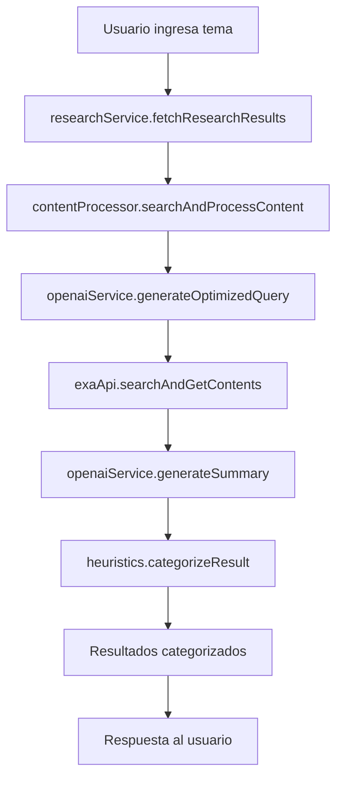

# 🏗️ Arquitectura del Sistema de Investigación

## 📁 Estructura de Carpetas

```
src/
├── 🔌 integrations/      # Integraciones con APIs externas
│   ├── exa/             # API de búsqueda Exa
│   │   └── exaApi.ts
│   └── openai/          # API de OpenAI para procesamiento
│       └── openaiService.ts
├── 🧠 analysis/         # Lógica de análisis y procesamiento
│   ├── heuristics.ts    # Algoritmos de categorización
│   └── contentProcessor.ts # Procesamiento completo de contenido
├── ⚙️ services/         # Servicios principales (orquestadores)
│   └── researchService.ts
├── 📚 lib/              # Utilidades y mocks
│   └── mocks.ts
└── 🎯 app/              # Aplicación Next.js
    ├── actions/         # Server Actions
    └── ...
```

## 🔄 Flujo de Datos



## 📦 Módulos y Responsabilidades

### 🔌 **Integrations** - Comunicación con APIs Externas

#### `integrations/exa/exaApi.ts`
- **Propósito**: Comunicación directa con la API de Exa
- **Funciones principales**:
  - `searchExaContent()` - Búsqueda en Exa
  - `getExaContents()` - Obtención de contenido completo
  - `searchAndGetContents()` - Búsqueda combinada

#### `integrations/openai/openaiService.ts`
- **Propósito**: Comunicación con OpenAI para optimización y resúmenes
- **Funciones principales**:
  - `generateOptimizedQuery()` - Optimización de consultas
  - `generateSummary()` - Generación de resúmenes

### 🧠 **Analysis** - Lógica de Análisis

#### `analysis/heuristics.ts`
- **Propósito**: Algoritmos de categorización y análisis de calidad
- **Funciones principales**:
  - `categorizeResult()` - Categorización principal
  - `categorizeByFreshness()` - Análisis de frescura
  - `categorizeByContentQuality()` - Análisis de calidad
  - `categorizeBySourceAuthority()` - Análisis de autoridad
  - `categorizeByKeywordRelevance()` - Análisis de relevancia

#### `analysis/contentProcessor.ts`
- **Propósito**: Orquestación del procesamiento completo
- **Funciones principales**:
  - `searchAndProcessContent()` - Proceso completo de búsqueda
  - `processSearchResults()` - Procesamiento de resultados

### ⚙️ **Services** - Orquestadores Principales

#### `services/researchService.ts`
- **Propósito**: Punto de entrada principal para investigación
- **Funciones principales**:
  - `fetchResearchResults()` - Función principal pública

## 🎯 Principios de Diseño

### ✅ **Ventajas de la Arquitectura**

1. **Separación de Responsabilidades**
   - Cada módulo tiene un propósito específico
   - Fácil mantenimiento y testing

2. **Modularidad**
   - Funciones independientes y reutilizables
   - Posibilidad de intercambiar implementaciones

3. **Escalabilidad**
   - Fácil agregar nuevas integraciones
   - Nuevos algoritmos de análisis

4. **Testabilidad**
   - Funciones puras fáciles de testear
   - Mocking simplificado

### 🔧 **Patrones Utilizados**

- **Functional Programming**: Funciones puras sin efectos secundarios
- **Dependency Injection**: A través de imports ES6
- **Single Responsibility**: Cada función tiene una responsabilidad
- **Composition over Inheritance**: Composición de funciones

## 🚀 Uso y Ejemplos

### Uso Básico
```typescript
import { fetchResearchResults } from '@/services/researchService';

const results = await fetchResearchResults('inteligencia artificial');
```

### Uso Avanzado con Opciones
```typescript
import { searchAndProcessContent } from '@/analysis/contentProcessor';

const results = await searchAndProcessContent('blockchain', {
  numResults: 15,
  daysBack: 7,
  includeDomains: ['nature.com', 'arxiv.org']
});
```

### Testing de Módulos Independientes
```typescript
import { categorizeResult } from '@/analysis/heuristics';
import { searchExaContent } from '@/integrations/exa/exaApi';

// Test de heurística
const result = categorizeResult(mockData, 'AI');

// Test de API
const searchResults = await searchExaContent('test query');
```

## 📈 Evolución y Futuro

### Posibles Mejoras

1. **Cache Layer**
   ```
   src/cache/
   ├── redisCache.ts
   └── memoryCache.ts
   ```

2. **Más Integraciones**
   ```
   src/integrations/
   ├── google/
   ├── bing/
   └── academic/
   ```

3. **Analytics**
   ```
   src/analytics/
   ├── metrics.ts
   └── reporting.ts
   ```

## 🔍 Debugging y Monitoreo

- Cada módulo incluye logging específico
- `heuristics.ts` incluye debug detallado de scores
- Fallbacks a datos mock en caso de error
- Error handling granular por módulo

---

**Arquitectura diseñada con principios de Clean Architecture y Functional Programming** 🎯 